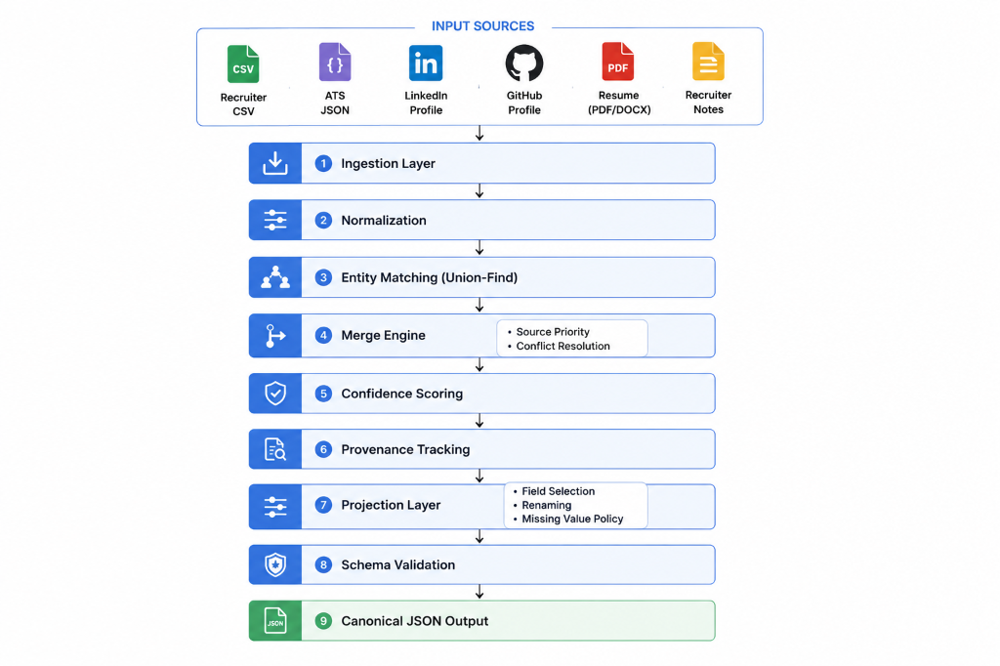

# Candidate Data Transformer


**A production-grade pipeline for ingesting, normalizing, and merging candidate profiles from seven heterogeneous data sources into a single canonical representation with provenance tracking and confidence scoring.**

---

## Problem Statement

Recruiting teams work with candidate data scattered across multiple systems — recruiter spreadsheets, ATS exports, GitHub profiles, LinkedIn data, resumes (PDF/DOCX), and free-text interview notes. Each source uses different schemas, field names, date formats, and levels of data quality.

This tool solves the **candidate identity resolution and data fusion** problem: given N records from M sources that may refer to the same person, produce a single, normalized, conflict-resolved canonical profile that tracks exactly where each field value came from and how confident we are in it.

---

## Architecture




### Pipeline Stages

| Stage | Module | Responsibility |
|-------|--------|----------------|
| **Ingest** | `ingestors/` | Parse each source format into `CandidateRecord` objects |
| **Normalize** | `normalizers.py` | Standardize phones (E.164), emails (lowercase), countries (ISO 3166), dates (YYYY-MM), skills (canonical names), names (title case), URLs (add scheme) |
| **Match** | `entity_matcher.py` | Group records into clusters of the same person using email ∩, phone ∩, and fuzzy name matching |
| **Merge** | `merge_engine.py` | Combine each cluster into one `CanonicalProfile` using source-priority conflict resolution |
| **Score** | `merge_engine.py` | Compute per-field and overall confidence scores |
| **Provenance** | Models | Track original value, normalized value, source, and transformations for every field |
| **Project** | `projection.py` | Apply runtime configuration to select/rename/filter output fields |
| **Validate** | `pipeline.py` | Schema validation of the final output |
| **Output** | `cli.py` | JSON serialization to stdout or file |

---

## Supported Sources

| Source | CLI Flag | Format | Priority | Base Confidence |
|--------|----------|--------|----------|-----------------|
| Recruiter CSV | `--csv` | CSV with headers | 6 (highest) | 0.90 |
| ATS JSON | `--json` | JSON array of candidates | 5 | 0.80 |
| Resume PDF | `--resume-pdf` | PDF document | 4 | 0.70 |
| Resume DOCX | `--resume-docx` | Word document | 4 | 0.70 |
| LinkedIn | `--linkedin` | LinkedIn API JSON export | 3 | 0.65 |
| GitHub | `--github` | Username, URL, or cached JSON | 2 | 0.55 |
| Recruiter Notes | `--notes` | Free-text TXT | 1 (lowest) | 0.40 |

---

## Default Output Schema

```json
{
  "candidates": [
    {
      "candidate_id": "uuid-v4",
      "full_name": "Alice Johnson",
      "emails": ["alice.johnson@example.com", "alice.j@gmail.com"],
      "phones": ["+15551234567"],
      "location": {
        "city": "San Francisco",
        "region": "CA",
        "country": "US"
      },
      "links": {
        "linkedin": "https://linkedin.com/in/alicejohnson",
        "github": "https://github.com/alicejohnson"
      },
      "headline": "Senior Data Scientist | ML & AI",
      "years_experience": 7.0,
      "skills": [
        {"name": "Python", "confidence": 0.95, "sources": ["recruiter_csv", "ats_json"]},
        {"name": "Machine Learning", "confidence": 0.90, "sources": ["recruiter_csv"]}
      ],
      "experience": [
        {
          "company": "Acme Corp",
          "title": "Senior Data Scientist",
          "start": "2021-03",
          "end": "present",
          "summary": "Led ML team building recommendation engines."
        }
      ],
      "education": [
        {
          "institution": "MIT",
          "degree": "MS",
          "field": "Computer Science",
          "end_year": "2020"
        }
      ],
      "provenance": [
        {
          "source": "recruiter_csv",
          "field": "full_name",
          "original_value": "ALICE JOHNSON",
          "normalized_value": "Alice Johnson",
          "normalizations_applied": ["title_case"],
          "confidence": 0.90,
          "timestamp": "2026-06-29T12:00:00"
        }
      ],
      "overall_confidence": 0.88
    }
  ]
}
```

---

## Merge Policy & Conflict Resolution

When multiple sources provide different values for the same scalar field (e.g., `full_name`), the system resolves conflicts deterministically:

1. **Source Priority Table** — Each source type has a fixed priority (see table above). Higher priority = higher trust.
2. **Winner Selection** — For scalar fields, the value from the highest-priority source wins.
3. **Collection Fields** — Lists (emails, phones, skills, experience, education) are merged via set union, then deduplicated.
4. **Experience/Education Dedup** — Entries are deduplicated using an MD5 hash of `company|title|start` (experiences) or `institution|degree|end_year` (education).
5. **Skills** — Duplicates detected after normalization are merged, with confidence boosted when multiple sources agree.
6. **Deterministic** — Given the same inputs, the pipeline always produces the same output (excluding UUIDs and timestamps).

---

## Confidence Calculation

Each field's confidence is computed as:

```
field_confidence = base_confidence(source) × agreement_factor
```

Where:
- `base_confidence` comes from `SOURCE_BASE_CONFIDENCE` (0.40 – 0.90)
- `agreement_factor` increases when multiple sources provide the same value (corroboration)
- `overall_confidence` is the weighted average of all field confidences

Skills get individual confidence scores that increase when the same skill appears across multiple sources.

---

## Provenance Tracking

Every field value in the canonical profile carries a `ProvenanceRecord` that tracks:

| Field | Description |
|-------|-------------|
| `source` | Which source type provided the value |
| `field_name` | The canonical field name |
| `original_value` | The raw value before normalization |
| `normalized_value` | The value after normalization |
| `normalizations_applied` | List of transformations applied |
| `confidence` | Confidence score for this specific value |
| `timestamp` | When the record was processed |

---

## Projection Layer (Runtime Configuration)

The output shape can be customized at runtime via a JSON configuration file:

```json
{
  "fields": ["full_name", "emails", "skills", "experience"],
  "rename": {
    "full_name": "candidateName",
    "emails": "emailAddresses"
  },
  "on_missing": "null",
  "include_provenance": false,
  "include_confidence": false
}
```

| Option | Type | Default | Description |
|--------|------|---------|-------------|
| `fields` | `list[str]` | all fields | Which fields to include in output |
| `rename` | `dict[str, str]` | `{}` | Map of `original_name → output_name` |
| `on_missing` | `str` | `"null"` | How to handle missing fields: `"null"`, `"omit"`, or `"error"` |
| `include_provenance` | `bool` | `true` | Whether to include provenance records |
| `include_confidence` | `bool` | `true` | Whether to include confidence scores |

---

## Setup

### Prerequisites

- Python 3.10 or later
- pip

### Installation

```bash
# Clone the repository
git clone https://github.com/your-org/candidate-transformer.git
cd candidate-transformer

# Install in development mode with test dependencies
pip install -e ".[dev]"
```

---

## Usage

### CLI

```bash
# Single CSV source
candidate-transformer --csv recruiter_data.csv

# Multiple sources
candidate-transformer --csv recruiter.csv --json ats_export.json --output result.json

# All sources with projection config
candidate-transformer \
  --csv recruiter.csv \
  --json ats_export.json \
  --github octocat \
  --linkedin linkedin_profile.json \
  --notes interview_notes.txt \
  --config projection.json \
  --output result.json \
  -v

# Version info
candidate-transformer --version

# Pipe to jq
candidate-transformer --csv data.csv -q | jq '.candidates[0].skills'
```

### Web UI Dashboard
For an interactive, visual experience, launch the Single Page Application (SPA) dashboard:
```bash
candidate-transformer --ui
```
This spins up a local FastAPI server and automatically opens your default browser at `http://127.0.0.1:8000`. It allows you to:
*   Drag-and-drop or select any of the 7 source files.
*   Monitor real-time progress steps as the 10-stage pipeline executes.
*   Browse fused candidate profile cards and view detailed experience/education timelines.
*   Interact with an audit log to see field-level `ProvenanceRecord` histories.
*   Tweak config settings (toggling provenance tracking and custom `on_missing` behavior) directly in the UI.

### Programmatic API

```python
from candidate_transformer.pipeline import run_pipeline
from candidate_transformer.projection import ProjectionConfig

sources = {
    "recruiter_csv": "path/to/recruiter.csv",
    "ats_json": "path/to/ats.json",
}

config = ProjectionConfig(
    fields=["full_name", "emails", "skills"],
    include_provenance=False,
)

results = run_pipeline(sources, config)
```

---

## Project Structure

```
eightfold/
├── pyproject.toml               # Project metadata, dependencies, CLI entry point
├── README.md                    # This file
├── DESIGN.md                    # Technical design document
├── src/
│   └── candidate_transformer/
│       ├── __init__.py          # Package init, version
│       ├── cli.py               # Click-based CLI entry point
│       ├── models.py            # Canonical data models (dataclasses)
│       ├── normalizers.py       # Field normalization functions
│       ├── entity_matcher.py    # Entity resolution / record linkage
│       ├── merge_engine.py      # Conflict resolution and merging
│       ├── projection.py        # Output projection layer
│       ├── pipeline.py          # Pipeline orchestrator
│       └── ingestors/
│           ├── __init__.py      # Ingestor public API
│           ├── csv_ingestor.py  # Recruiter CSV parser
│           ├── json_ingestor.py # ATS JSON parser
│           ├── github_ingestor.py
│           ├── linkedin_ingestor.py
│           ├── resume_ingestor.py
│           └── notes_ingestor.py
└── tests/
    ├── __init__.py
    ├── conftest.py              # Shared fixtures and test data
    ├── test_normalizers.py      # Unit tests for normalizers
    ├── test_entity_matcher.py   # Unit tests for entity matching
    ├── test_merge_engine.py     # Unit tests for merge engine
    ├── test_projection.py       # Unit tests for projection layer
    ├── test_ingestors.py        # Unit tests for all ingestors
    └── test_pipeline.py         # End-to-end integration tests
```

---

## Design Decisions & Assumptions

1. **Deterministic output** — Given identical inputs, the pipeline produces identical output (except for dynamic elements like execution timestamps). This enables regression testing and audit trails. In regression testing, the timestamp and candidate UUID are stripped out for deterministic bit-by-bit comparisons.

2. **Source priority is static** — Priority is fixed per source type. A recruiter-verified CSV is always trusted more than free-text notes. This is a deliberate simplification; a production system might allow per-field or per-record trust overrides.

3. **E.164 for phone numbers** — All phone numbers are normalized to E.164 using the `phonenumbers` library. Numbers that can't be parsed are discarded with a warning (not silently passed through).

4. **ISO 3166-1 alpha-2 for countries** — Full country names, alpha-3 codes, and common aliases are mapped to alpha-2 using `pycountry`.

5. **Skill canonicalization** — Common aliases (e.g., "JS" → "JavaScript", "k8s" → "Kubernetes", "ML" → "Machine Learning") are mapped to canonical names. Unknown skills are title-cased and passed through.

6. **Entity resolution is transitive** — If record A matches B (shared email) and B matches C (shared phone), all three are merged. This uses a Union-Find data structure. **Strict Conflict-Avoidance Heuristic:** To prevent false positives (e.g., the 'Michael Chen' problem), name-only matching is explicitly rejected if the records have conflicting unique identifiers (different emails, phones, LinkedIn URLs, or GitHub handles).

7. **Resume parsing is best-effort** — PDF and DOCX parsing uses heuristic extraction. Missing or unreadable files produce warnings, not crashes.

8. **No external API calls in tests** — GitHub tests use cached JSON files, not live API calls. Unauthenticated live API calls handle rate limit 403 HTTP status codes gracefully without crash.

9. **LinkedIn Profile Ingestion Justification** — LinkedIn profile data is ingested via exported JSON dumps rather than direct live scraping or profile API calls. LinkedIn lacks a public profile REST API, and automatic page scraping violates their Terms of Service, introducing severe legal and rate-limit risks for production systems.

---

## Edge Cases Handled

| Edge Case | Handling |
|-----------|----------|
| Same person across 5+ sources | All matched and merged correctly |
| Conflicting names ("Alice J." vs "Alice Johnson") | Highest-priority source wins |
| Duplicate emails across sources | Set union, no duplicates in output |
| Phone numbers in different formats | All normalized to E.164 before comparison |
| Missing fields in source data | Filled from other sources if available |
| Completely empty input file | Returns empty candidate list |
| Malformed CSV (inconsistent columns) | Graceful handling, partial extraction |
| Invalid JSON syntax | Clear error message, pipeline aborts |
| No matching candidates | Each record becomes its own profile |
| Skills with aliases ("JS", "JavaScript") | Merged into canonical "JavaScript" |

---

## Testing

A comprehensive test suite of **122 unit and integration tests** is included to validate the correctness and robustness of all pipeline stages, covering ingestors, normalizers, disjoint-set entity matching, source-priority merge rules, scoring matrices, and projection configs.

```bash
# Run the complete test suite of 122 tests
pytest

# Run tests in verbose mode
pytest -v

# Run tests quietly
pytest -q

# Run with coverage report
pytest --cov=candidate_transformer --cov-report=term-missing
```

---

## Future Improvements

- **Pluggable ingestor registry** — Allow users to register custom ingestors for new source types without modifying core code.
- **Fuzzy name matching** — Use Jaro-Winkler or Levenshtein distance for name-based entity resolution.
- **Machine-learned confidence** — Replace heuristic confidence scoring with a trained model.
- **Incremental merging** — Support streaming / incremental updates without reprocessing all sources.
- **Web UI** — Dashboard for reviewing merge decisions and resolving ambiguous matches.
- **Async pipeline** — Parallelize ingestors for large batch processing.
- **Field-level override API** — Allow downstream consumers to provide ground truth that overrides merged values.

---

## License

MIT
